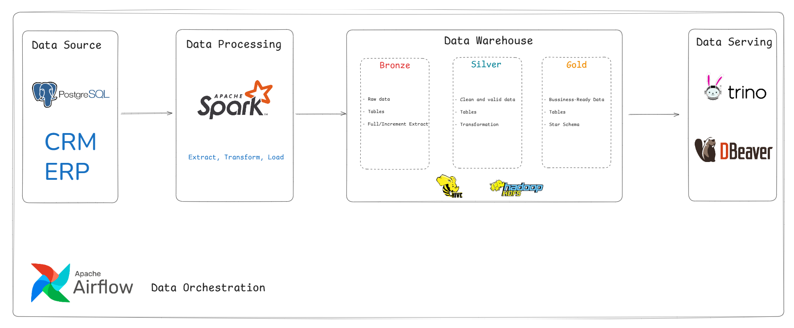
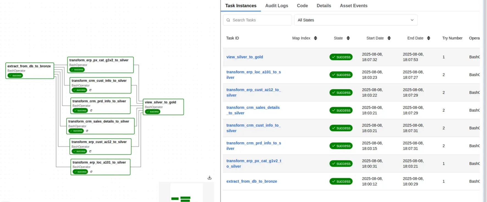
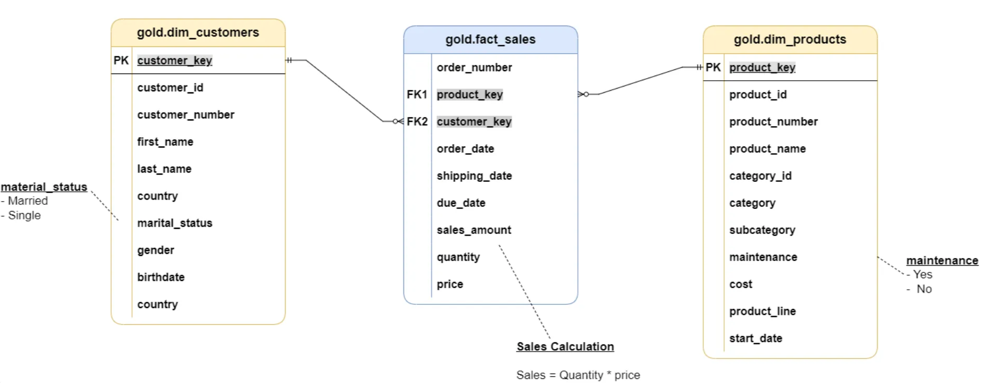

# Project: Building a Data Warehouse with Apache Ecosystem

## 🌐 Overview



This repository demonstrates how to **design, implement, and operate a modern data warehouse** using a suite of open-source Apache tools. 

This project involves:

1. **Data Architecture**: Designing a Modern Data Warehouse Using Medallion Architecture **Bronze**, **Silver**, and **Gold** layers.
2. **ETL Pipelines**: Extracting, transforming, and loading data from source systems into the warehouse.
3. **Data Modeling**: Developing fact and dimension tables optimized for analytical queries.

---

## 📚 Table of Contents

- Architecture
- Project Structure
- Setup
- Data Pipeline

---

## 📐 Architecture

A **Data Warehouse** is a centralized repository designed to aggregate data from multiple sources, enabling advanced analytics, reporting, and BI. This project follows a **multi-layered approach**:

- **Bronze Layer**: Raw ingested data.
- **Silver Layer**: Cleaned and transformed data.
- **Gold Layer**: Business-ready views and aggregated metrics for analytics.

## 💻 Technologies Used

| Technology | Version | Purpose |
| --- | --- | --- |
| Apache Hadoop | 3.4.1 | Distributed file storage for the data warehouse |
| Apache Hive | 4.0.1 | Metastore and query interface for the data warehouse |
| Apache Spark | 4.0 | Data ingestion and processing; updates schemas in Hive |
| Apache Airflow | 3.0.3 | Data orchestration for the pipeline |
| PostgreSQL | 16.9 | Source database and storage for extraction config/log tables |
| Trino | 476 | Query engine for Hive data warehouse |

## 🪜Project Structure

```
data-warehouse-apache-ecosystem/
├── dags/
│   └── etl_dag.py                # Airflow DAG for orchestrating ETL jobs
├── data/
│   └── raw_data/                 # Source CSV files for initial load
├── src/
│   ├── bronze/
│   │   ├── create-bronze-schema.hql
│   │   ├── extract.py            # Extract data from PostgreSQL to Bronze layer
│   │   └── init_bronze.py        # Create Bronze tables in Hive
│   ├── silver/
│   │   ├── create-silver-schema.hql
│   │   ├── init_silver.py        # Create Silver tables in Hive
│   │   ├── transform_crm_cust_info.py # Transform from bronze, then load to silver
│   │   ├── transform_crm_prd_info.py
│   │   ├── transform_crm_sales_details.py
│   │   ├── transform_erp_cust_az12.py
│   │   ├── transform_erp_loc_a101.py
│   │   └── transform_erp_px_cat_g1v2.py
│   ├── gold/
│   │   ├── create-gold-schema.hql
│   │   ├── init_gold.py          # Create Gold tables in Hive
│   │   └── view_gold.py          # Load data from silver and examle query for see data.
│   ├── initial/
│   │   ├── load_dataset.sql      # SQL function to load CSVs into PostgreSQL
│   │   ├── load.sh               # Shell script to setup and load initial data
│   │   └── source_db.sql         # PostgreSQL DDL for source tables
│   ├── trino/
│   │   ├── test.sql      # Trino queries to practice and test
├── images/               # Images for README
├── README.md                     # Project documentation (to be created)
```

---

## ⚒️ Setup

This project requires several Apache services, each running under dedicated users and groups.

For a smooth setup, use a service account that:

- Has permission to access **Hive** and write to the Hive Data Warehouse.
- Can execute **Spark** jobs via `spark-submit`.
1. **Setup PostgreSQL and load initial data:**
    
    ```
    bash src/initial/load.sh
    ```
    
2. **Create Hive tables (Bronze, Silver, Gold):**
    
    ```
    spark-submit src/bronze/init_bronze.py
    spark-submit src/silver/init_silver.py
    spark-submit src/gold/init_gold.py
    ```
    
3. **Run ETL pipeline via Airflow:**
    - Start Airflow webserver and scheduler.
    
    ```
    airflow scheduler
    airflow api-server -p 8080
    ```
    
    - Trigger or schedule the DAG in `etl_dag.py` .
    
    
    
4. **Practice query**

Once the Gold schema are ready, you can:

- Use **HiveQL** in the Hive CLI to run analytical queries on the Data Warehouse.
- Or use **Trino** with the Hive connector for faster, interactive querying. Some queries I used is defined in `trino/test.sql`


---

## 💡Data Pipeline

---

### 1. Data Source & Modeling

This project uses **dimensional modeling** with a **Star Schema** to organize data for analytics.

- **Source Systems:** The raw source data is located in `/data/raw_data` and comes from two systems:
    - **CRM** – Holds sales transactions, product details, and customer information.
    - **ERP** – Contains product categories, customer attributes (e.g., birthdate), and location data.
    - To practice **incremental extraction**, I have added a column named `src_update_at` to track the time when data was generated in source system.
- **Data Modeling (Star Schema):**
    - **Fact Table:** `fact_sales` – Stores sales transactions with metrics like sales amount, quantity, and price.
    - **Dimension Tables:**
        - `dim_customers` – Contains customer demographics and profile information.
        - `dim_products` – Holds product attributes, categories, and cost details.

This structure enables efficient analytical queries by linking facts to descriptive dimensions.




### 2. Data Extraction

This project implements **two batch extraction approaches** using **Spark (PySpark).**

- **Full Extraction** – Initial one-time extraction of all data.
- **Incremental Extraction** – Daily extraction of new or updated data, determined using the `src_update_at` column.

The extraction code is defined in `src/bronze/extract.py`

Extracted data is stored in the **Bronze Layer** of the Data Warehouse. The Bronze Layer is defined in `/src/bronze/create-bronze-schema.hql` 

To run the ingestion:

```bash
spark-submit src/bronze/extract.py
```

When the extraction is finished, the ingestion program also writes execution metadata into the `job_info` and `job_log` tables, stored in the source database. For example:

```
select config_id, job_name, source_table, destination_table, load_type from  job_config limit 20;
```


---

### 3. Data Transformation & Data Load

Data transformation is performed using **PySpark** and **SparkSQL**, the data will be read from Bronze Layer (all raw data) then applying transformation techniques such as:

- Data cleansing
- Deduplication
- Derived column creation

Transformation scripts are located in the `src/silver/` directory.

To execute a specific transformation, for example for `crm_cust_info`, run:

```bash
spark-submit src/silver/transform_crm_cust_info.py
```

The cleaned and validated data is then **overwritten** into the **Silver Layer**. The Silver Layer is defined in `/src/silver/create-silver-schema.hql` 

---

### 4. Data Serving

- To support **business analytics**, the **Gold Layer** is built with a **Star Schema.**
- The Gold Layer is defined in `/src/gold/create-gold-schema.hql`
- Transformed data from the Silver Schema is inserted into the Gold Schema.

Once the Gold Layer is ready, analytical queries can be executed using **Hive CLI** with HiveQL or **Trino** against the **Hive Data Warehouse**.

### 5. Data orchestration

This project uses **Apache Airflow** to orchestrate the ETL workflow.

The DAG definition is located at: `dags/etl_dag.py`

It coordinates the extraction, transformation, and loading processes across the **Bronze**, **Silver**, and **Gold** layers, ensuring tasks are executed in the correct order and on schedule.

---

### **🛡️ License**

You are free to use, modify, and share this project with proper attribution.
